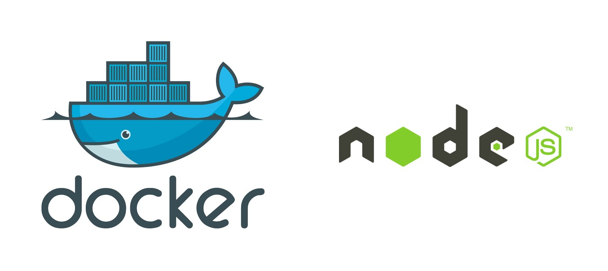

# Docker-node.js


 
## Software Stack
- [x] MongoDB
- [x] Redis
- [x] MySQL
- [x] Node.js 7.x
- [x] Nginx


## How to use it?

>If live behind the [GFW](https://zh.wikipedia.org/zh-hans/%E9%98%B2%E7%81%AB%E9%95%BF%E5%9F%8E) please read this post [Use Ali cloud](http://www.myfreax.com/use-aliyun-mirror-acceleration-on-docker/)


#### Requirements

- [Docker](https://www.docker.com/)

- [Docker-compose](https://github.com/docker/compose/releases)

#### Setup

```bash

git clone https://github.com/huangyanxiong01/docker-node.js.git

cd docker-node.js

yarn install

docker-compose up -d

```

Now,you can open http://127.0.0.1:3000/ in browser

#### Configure 

You can find the custom $software configuration file in `./docker/$software/etc/`


#### Data

You can find the  $software data file in `./docker/$software/Data/`

## TODO

- [ ] Build the nginx image with the lua module
- [ ] Optimize the configuration file
- [ ] Test on Windows

##### Why do need Lua module?

> The nginx configuration file uses environment variables


## Change Log
[Changelog.md](changelog.md)


## Other

```

docker pull huangyanxiong2012/docker-node.js

```


## Note

> If Ubuntu official source is too slow,You can add command in Dockerfile

```

FROM ubuntu:16.04
COPY ./sources.list /etc/apt/sources.list

```